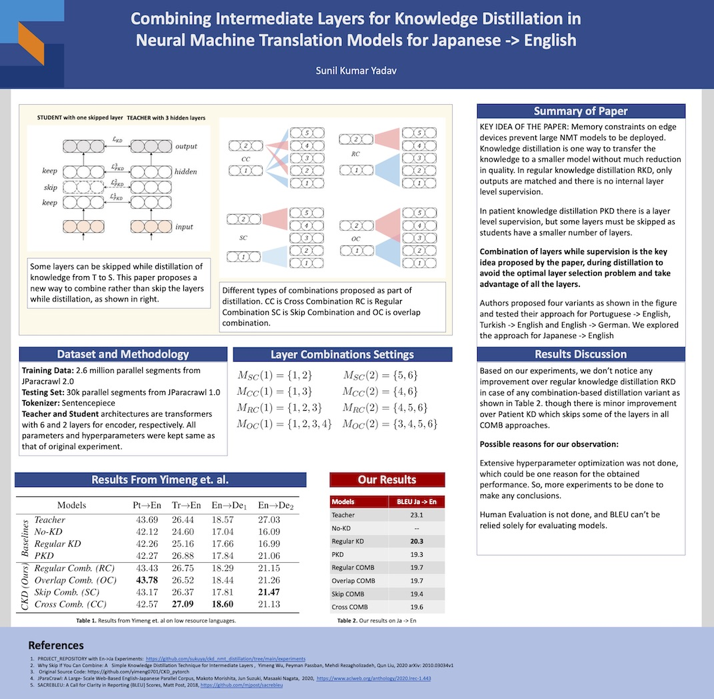

### STEPS 17th Project
Following exploratory work was presented at [CS6101 Module Projects Display at 17th STEP](https://isteps.comp.nus.edu.sg/event/17th-steps/module/CS6101/project/7)

### Combining Intermediate Layers for Knowledge Distillation in Neural Machine Translation Models for Japanese -> English

This project investigates the newly introduced technique to combine intermediate layers rather than skipping while performing knowledge distillation of NMT Models. The language pair investigated is `Japanese->English` using the recently published work by Yimeng Wu et. al. for `Portuguese->English`, `Turkish->English`, and `English->German`. They were able to distill similar performance with a 50% reduction in parameters. Their results and paper can be referred at the following link:
[Why Skip If You Can Combine: A Simple Knowledge Distillation Technique for Intermediate Layers](https://arxiv.org/abs/2010.03034)
We use [JParacrawl]()  for our investigation and the source code from [Yimeng's](https://github.com/yimeng0701/CKD_pytorch) work.

### Our Results
Following are the results for English --> Japanese based on a training corpus of 2.6 million sentences from JParacrawl.
| MODELS              |   | BLEU SCORES |
|---------------------|---|-------------|
|     Teacher         |   |     23.1    |
|     Regular KD      |   |     20.3    |
|     PKD             |   |     19.3    |
|     Regular COMB    |   |     19.7    |
|     Overlap COMB    |   |     19.7    |
|     Skip COMB       |   |     19.4    |
|     Cross COMB      |   |     19.6    |

### Discussions
Based on our experiments, we don’t notice any improvement over regular knowledge distillation RKD in case of any combination-based distillation variant as shown in figure above, though there is minor improvement over Patient KD which skips some of the layers in all COMB approaches. 
Possible reasons for our observation:
Extensive hyperparameter optimization was not done, which could be one reason for the obtained performance. So, more experiments to be done to make any conclusions.
Human Evaluation is not done, and BLEU can’t be relied solely for evaluating models.

## Requirements
Check `README_CKD_Original.md`

## Acknowledgement
This repo is exploration based on original source at [CKD_PyTorch](https://github.com/yimeng0701/CKD_pytorch) which is the original implementation of the paper `Why Skip If You Can Combine: A Simple Knowledge Distillation Technique for Intermediate Layers`, Yimeng Wu, Peyman Passban, Mehdi Rezagholizadeh, Qun Liu at Proceedings of EMNLP, 2020.
